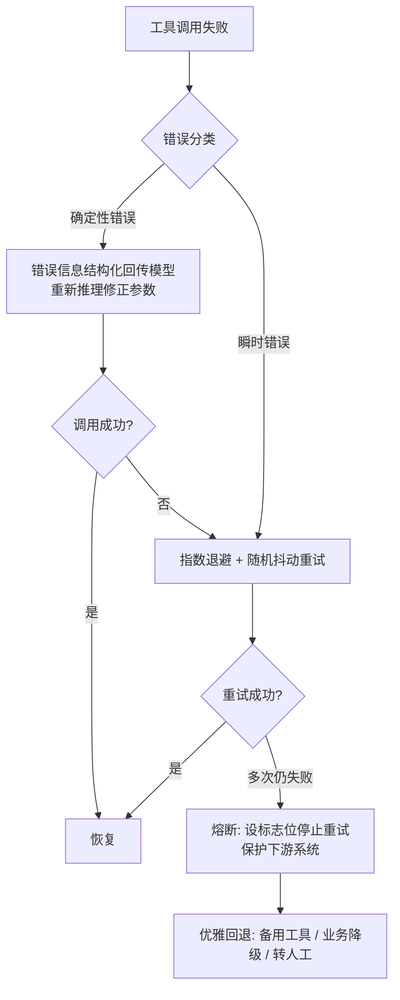
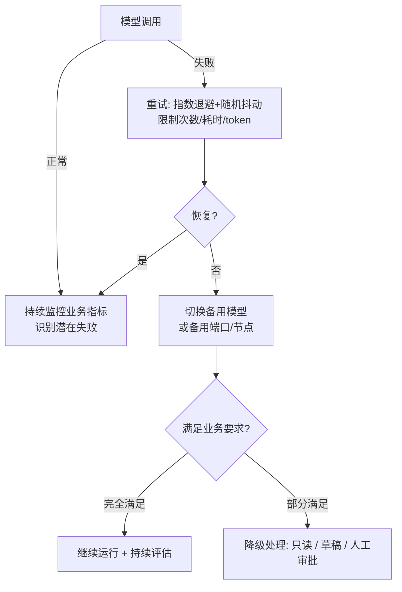

# Agent 健壮性设计笔记：调用失败如何处理

> 来源：宇树科技一面 / 英伟达一面高频题——Agent 调用工具失败、模型调用失败的容错与兜底

---

## **一、核心目标（要做什么）**

设计高可用 Agent：**故障发生时尽最大可能修复；修复不了时优雅兜底**。这是 Demo 项目与企业级项目的核心分水岭。

两类最常考故障，处理思路完全一致（模型调用本质也是一次外部 API 工具调用）：

| 故障类型 | 典型场景 |
|---|---|
| 工具调用失败 | 本地工具、MCP 工具、服务端 API 调用失败 |
| 模型调用失败 | 调用 Claude / GPT 等大模型 API 失败 |

**通用处理主线：错误分类 → 针对性修复/重试 → 熔断 → 优雅降级回退**

---

## **二、工具调用失败：四步处理法（怎么做）**

### **Step 1：先对错误分类（答题第一句话说这个）**

- **确定性错误**：同样输入必然同样失败，如参数缺失、参数非法（invalid argument）→ 可修复
- **瞬时错误**：网络波动、网络中断等，同样输入可能这次失败、下次成功 → 可重试

### **Step 2：确定性错误 → 错误信息回传，让模型自我修复**

把错误信息作为**结构化的提示词片段**喂回给模型，让模型重新推理、修正参数后再次发起调用，大概率可修复。

### **Step 3：瞬时错误 → 重试（指数退避 + 随机抖动）**

- **指数退避（Exponential Backoff）**：重试间隔呈指数增长，如 1s → 2s → 4s → 8s（基数可调，如 1.1s → 2.2s → 4.4s，核心是"指数增长"而非具体数值）
- **随机抖动（Jitter）**：在重试间隔上叠加随机扰动。若上万台机器同时故障且按同一节奏重试，会在同一时刻冲击下游服务；加抖动后重试时间点错开（1.1s vs 1.2s），避免请求洪峰

### **Step 4：多次重试仍失败 → 熔断**

设置标志位，一段时间内停止重试。逻辑：重试多次仍失败，说明故障并非"瞬时"，可能持续很久，继续重试无意义。**作用：保护 Agent 自身与下游系统。**

### **Step 5：优雅回退——按能力等级逐级降级（结合业务场景答）**

1. **有备用工具** → 直接切换备用工具顶上
2. **无备用工具** → 业务降级：100% 功能不可用，但保证 80% 核心业务可用
3. **高风险操作** → 转人工介入 / 人工提示

核心：即使失败，也要优雅退出战场，而不是直接"蓝屏"甩给用户。

---

## **三、模型调用失败：四步处理法（怎么做）**

### **Step 1：瞬时抖动 → 重试，但严格控制成本**

同样使用指数退避 + 随机抖动，但大模型场景下**重试是有成本的**，必须关注三个约束：

- 限制最大调用次数
- 控制总耗时
- 控制 token 消耗（每次调用都产生费用）

### **Step 2：识别"潜在失败"——监控业务指标（加分点）**

**潜在失败**：API 返回成功，但业务结果是错的。典型原因：上游模型服务升级或异常，输出随机、质量退化。

做法：**持续监控业务指标 / 输出质量**，检测模型能力退化，确认风险后采取对应策略。

### **Step 3：持续不可用 → 切换备用方案**

先尝试不同端口 / 不同服务节点；仍失败则**切换备用模型**（主模型 A 挂 → 备用模型 B 顶上），保证系统整体可用。

### **Step 4：切换备用模型后持续评估（加分点）**

切换备用模型 ≠ 万事大吉。不同模型的能力、上下文长度、推理特点都不同，需要：

- 用业务指标衡量备用模型的输出质量
- 若只能满足部分要求，执行配套降级策略：**降级为只读、生成草稿、人工审批**
- 根据备用模型的风险特征，相应调整业务逻辑

---

## **四、完整处理流程图**

**工具调用失败处理流程：**

**模型调用失败处理流程：**

---

## **五、重点结论（面试直接背）**

1. **答题框架**：先讲错误分类（确定性 vs 瞬时），再讲重试与熔断，最后讲优雅降级回退；兜底部分结合自己的业务场景展开，答案最完美。
2. **差异化加分点一**：不能只从 API 层面判断模型是否调用失败——API 返回 OK 但业务结果错误，属于"潜在失败"，必须靠业务指标监控来发现。
3. **差异化加分点二**：切换备用模型不代表万事大吉——模型间能力、上下文长度、推理风格存在差异，切换后仍需业务侧衡量与适配。
4. **技术关键词**：指数退避（Exponential Backoff）、随机抖动（Jitter）、熔断（Circuit Breaker）、能力分级降级——这些不是大模型行业独有，传统后端同样适用，说出来体现工程素养。

---

## **六、为什么这样设计（动机）**

- 面试官考察的本质是**项目的高可用性**：故障时能否最大程度自我修复，不能修复时能否优雅兜底。
- 该题在英伟达一面（社招资深岗，5 年以上经验）和宇树科技一面（校招）均出现，覆盖社招与校招，属于通用高频考点。
- Demo 项目通常"跑通即可"，企业级项目必须考虑故障场景——能讲清这套设计，即证明你具备生产环境的工程思维。
