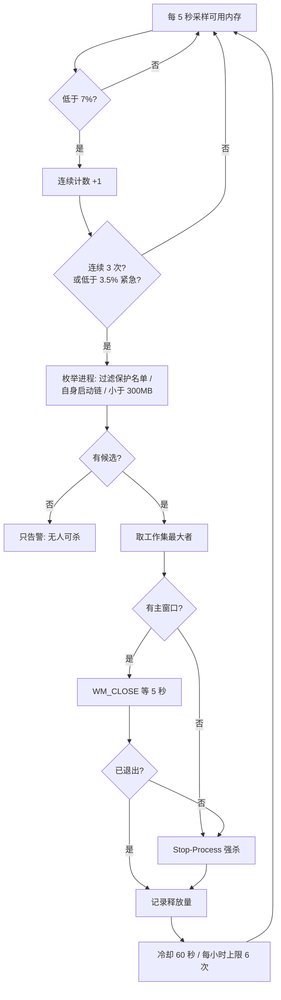

> 来源：本机实测（2026-09）。环境：Windows 11 + PowerShell 5.1，32GB 内存的开发笔记本。

---

## **一、动机：32GB 也会被吃干**

这台机器 32GB 内存，但在若干 Electron 应用同时开着的时候，可用内存会在一天内多次跌到 3% 附近：鼠标开始一顿一顿、切窗口要等几秒、任务管理器刷不出来——典型的换页风暴前兆。

同一时刻的进程组内存快照（按进程名聚合）：

| 进程组 | 实例数 | 合计 |
|---|---|---|
| CodeBuddy CN | 22 | 4815 MB |
| Tabbit Browser | 20 | 2344 MB |
| WorkBuddy | 13 | 2266 MB |
| msedgewebview2 | 29 | 1672 MB |
| Weixin（含小程序容器 WeChatAppEx） | 14 | 1806 MB |
| QClaw node gateway | 2 | 443 MB |

特征很明确：**Electron 应用每个都是 10~20 个进程**，单进程几百 MB。当"最大的单个进程"都在 300~1400MB 量级时，系统已经没有余量了。

先声明定位：**这不是内存优化器**。它不提升性能、不清理缓存、不"释放"任何本该被占用的内存。它是一道**最后防线**——当可用内存跌到临界值、系统即将进入卡死状态之前，杀掉当时占用最大的那个进程，把系统从悬崖边拉回来。丢掉的是一个后台程序的几十分钟工作，换来的是整机可用。

---

## **二、核心设计：回答四个问题**

### **1. 什么时候动手？**

两级阈值 + 持续采样 + 紧急通道：

| 级别 | 条件 | 动作 |
|---|---|---|
| WARN | 可用内存低于 12% | 只记日志（10 分钟去抖） |
| CRITICAL | 低于 7% **且连续 3 次采样**（5 秒一次） | 执行 |
| EMERGENCY | 低于 3.5% | 立即执行，不等确认 |

"连续 3 次采样"是必要的防抖：内存占用存在瞬时波动（一次大分配、一次页面回收），单次越线不该触发杀进程。而 3.5% 以下的紧急通道是为了应对"来不及等 15 秒确认"的雪崩场景——实测中它确实被触发过多次（3.3%、2.9%、2.1%）。

### **2. 动谁？**

按**工作集（Working Set）**降序取最大值，跳过小于 300MB 的进程。

- 为什么用工作集：它最接近"这个进程现在真实占着多少物理内存"（任务管理器"内存"列的近似口径）。
- 为什么设 300MB 地板：如果连最大的进程都不到 300MB，说明内存不是被单进程吃掉的，杀谁都没用，只会白伤一个程序——此时只告警，不动手。

### **3. 怎么动？**

先礼后兵，并留下证据：

1. 有主窗口的进程：先发 `WM_CLOSE`（等价于点窗口关闭按钮），给它 5 秒自己退出；
2. 超时或没有窗口：`Stop-Process -Force` 强杀；
3. 杀完等 3 秒，记录释放量（`before → after`）；
4. **每轮只杀一个**，冷却 60 秒后再重新评估；每小时最多 6 次。

第 3、4 条是防雪崩的关键：杀一个、观察、再决定，而不是一次清场。

### **4. 谁不能杀？**

这一条经历了两次完整的策略反转，值得单独讲：

| 版本 | 保护策略 | 结果 |
|---|---|---|
| v1 | 55 项系统进程 + shell + 安全软件 | 太保守：微信、IDE、浏览器都在名单外，但"系统进程"边界划得过宽 |
| v2 | **零保护**（只保脚本自身启动链） | 太激进：`dwm`、`Memory Compression` 这类进程也进入候选，虽然杀不掉或影响可控，但白白浪费尝试机会 |
| v3（当前） | **只保护 45 项"系统关键进程"**：内核/会话（`csrss`/`lsass`/`winlogon`/`dwm` 等）、OS 基础设施（`svchost`/`explorer`/搜索索引等）、安全软件（Defender + 电脑管家） | 应用进程一律可杀，取舍交给使用者 |

结论：**保护名单不是技术问题，而是策略问题**——"谁有权决定杀掉用户的哪个程序"没有标准答案。最终形态是：脚本只硬保护"杀了会立刻蓝屏/注销/破坏系统"的最小集合，其余通过一个纯文本 `protect-list.txt` 交给使用者自己定义。

四个问题合起来，就是完整的一次决策流程：



---

## **三、真正的难点：守护者自身的可靠性**

一个"定时任务 + 杀进程"的脚本，半小时能写完。难的是另一个问题：

> **当你需要它的时候，它还在不在？**

内存守护脚本最讽刺的失效方式是：某天系统真的卡死了，你去看日志——它三周前就悄悄退出了。

所以它需要三层保障：

1. **开机自启**：登录时启动（`AtLogOn` 触发器）；
2. **心跳自愈**：一次性触发器 + **每 5 分钟无限重复**；配合 `MultipleInstances=IgnoreNew`（单实例策略）——守护进程活着时，心跳是 no-op（不会起第二个实例）；它一旦死了，下一次心跳（≤5 分钟）自动把它拉起来；
3. **防被动停止**：`ExecutionTimeLimit=0`（永不超时终止）、允许电池模式运行、失败后自动重试 999 次。

### **踩到的两个坑（PowerShell + 任务计划）**

**坑一：`RepetitionDuration` 不能是 `TimeSpan::MaxValue`。**

想当然地写"无限重复"，注册时会直接失败：

```text
Register-ScheduledTask : The task XML contains a value which is
incorrectly formatted or out of range.
(10,42):Duration:P99999999DT23H59M59S
```

正解：**省略 `-RepetitionDuration` 参数**——空的 Duration 就表示无限重复。

**坑二：只有 `AtLogOn` 触发器时，`NextRunTime` 是空的。**

因为"已登录"状态下，"下次登录"是个无法计算的时间点。改用"一次性触发器 + 重复间隔"作为心跳源之后，`NextRunTime` 正常滚动（每 5 分钟），也让"自愈是否在生效"变得可观察。

### **自愈实测**

```
20:10:34  手动杀掉守护进程（模拟崩溃）
20:15:19  心跳触发
20:15:20  新守护进程自动出现
```

空窗 **4 分 46 秒**，全程无人工介入。同时验证了单实例策略：此前一次心跳发生在守护存活期间，被正确忽略，没有出现第二个实例。

---

## **四、真实战报**

上线三天，其中两天就"实战"了。以下是 09-21 晚 ~ 09-22 上午的部分记录（共 12 次真实终止动作）：

| 时间 | 触发时可用内存 | 动作 | 释放 |
|---|---|---|---|
| 09-21 22:02 | 6.2% | Tabbit Browser 1444MB | 1467MB |
| 09-21 22:07 | 4.9% | Tabbit Browser 1407MB | 908MB |
| 09-21 22:18 | 6.6% | CodeBuddy CN 740MB | 1199MB |
| 09-22 07:43 | 6.2% | Marvis 846MB（**拒绝访问**）→ 顺延 node 794MB | 556MB |
| 09-22 07:46 | **3.3%（紧急）** | git 830MB | 935MB |
| 09-22 07:48 | **2.1%（紧急）** | node 1230MB | 1793MB |
| 09-22 09:04 | 6.3% | Tabbit Browser 1388MB | 1437MB |

三个安全机制在生产中被真实触发：

1. **候选顺延**：第一名 `MarvisKnowledgebase` 杀不掉（无权限）→ 自动尝试下一个 → 成功释放 556MB；
2. **频率刹车**：`LIMIT hourly kill limit reached (6/h)` 在压力最大的时段被多次命中——没有这一层，反复的"杀-重生"会变成无限互撕；
3. **紧急通道**：2.1% / 2.9% / 3.3% 三次不等 15 秒确认窗口直接动手。

---

## **五、诚实的局限（比功能更重要）**

### **1. 判据单一：只看物理内存**

真正的"快卡死"信号其实是**提交内存（commit）压力**和硬错误页速率。本机在高压时段 commit 一度到 **72%**——那才是操作系统真正开始挣扎的地方。当前脚本只把 commit 记录进日志，**没有纳入判定**，这是明确的 roadmap 而非已完成特性。

### **2. "杀进程"永远是最后手段**

Windows 的内存管理哲学是"空闲内存是浪费的内存"：缓存随用随占、随放随清，可用内存低本身不是病。把"内存占用高"当成异常，是很多"内存优化"工具的原罪。这个脚本的适用场景很窄：**机器被少数失控进程拖到临界，且你接受牺牲它们**。它不是日常手段。

### **3. "杀-重生"循环：一个值得记住的根因**

日志里出现过一个反复被杀又反复回来的进程：某 Electron 应用托管的 `openclaw-gateway`（node 工作进程，400MB~1.2GB），被杀后 **9 秒**就回来了：

```
07:50:03  杀掉 gateway (pid 47372, 857MB)
07:50:12  新 gateway (pid 47968) 出现
```

根因：它是被**应用主进程**（Electron supervisor）托管的后台服务，子进程退出会被主进程重新 spawn。这同时解释了一个常见疑问——"为什么我手动关掉它就不重启？"：

- 手动操作通常结束的是**主进程**（托盘退出/结束应用）= 断根 → supervisor 没了，不会重生；
- 而按内存排序的脚本只能选到**叶子**（真正吃内存的工作进程），根进程往往只有一两百 MB，排在候选之外；
- 结论：**杀叶子 = 白杀（会被重生），杀根 = 有效（但等于关掉用户整个应用）**。这是一个策略选择，没有技术上的免费午餐。

### **4. 误杀风险**

有窗口的进程虽然先发 `WM_CLOSE`，但用户可能来不及保存；无窗口的后台服务会被直接强杀（可能丢状态）。因此脚本内置了 `-DryRun` 演练模式：先跑几天，看看"它想杀的都是谁"，再决定是否开火。

---

## **六、可复用的设计原则**

如果你也在写"最后防线"类的常驻工具（内存、磁盘、温度，都一样），这五条来自本次实践：

1. **第一优先级是"不添乱"**：演练模式、白名单/保护名单、频率上限、冷却期、动作留档——一个会误伤的守护比没有守护更糟；
2. **守护者自身要被设计**：心跳、幂等、单实例、不限时、失败重试。"它还在不在"和"它能不能干活"同等重要；
3. **明确写下"我看不到什么"**：单一判据（只看物理内存）要在文档里承认，而不是让使用者误以为它无所不能；
4. **策略问题交还使用者**：保护名单用纯文本文件暴露出来，而不是硬编码一份"我认为对"的名单；
5. **每个动作都可追溯**：杀之前记录进程名/PID/路径/完整命令行，杀之后记录释放量——事后复盘时，这些证据比"我记得当时很卡"有用得多。

---

> 工具本身只有 500 行 PowerShell，零依赖（P/Invoke 直读 kernel32 采样，不装任何运行时）。但把它写"可靠"的过程，比写"能跑"的过程有价值得多——这也是这篇复盘真正想记录的东西。
